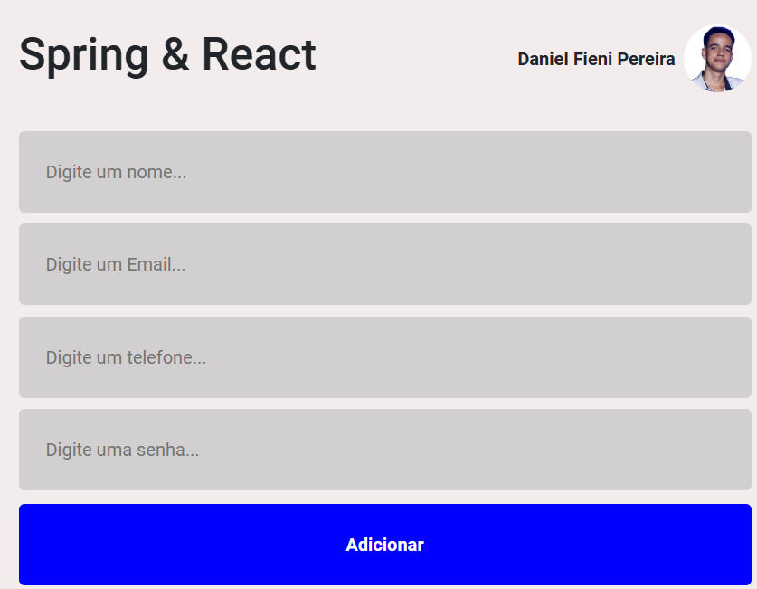

# Aplicação Web - Spring boot & React

## Comandos importantes React
```
npm create vite@latest frontend -- -- template react
npm install react-bootstrap bootstrap
npm install
npm install axios
npm run dev
```

## Tecnologias utilizadas
* Java
* React
* Html
* Css
* Bootstrap
* Axios
* Spring boot
* REST API
* PostgresSQL

